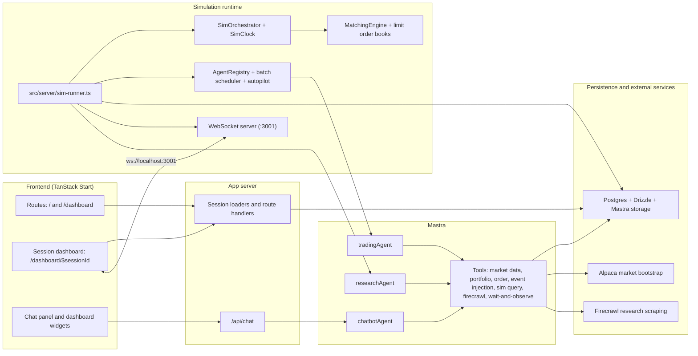

# Sardine

**Sardine** is an AI-driven market simulation platform built with Mastra, TanStack Start, and a live trading-style dashboard.

[](./LICENSE)


Sardine combines a configurable market simulator, Mastra-powered trading and research agents, a what-if chatbot, and a multi-panel dashboard for watching price action, order flow, and agent behavior in real time.

[](https://www.loom.com/share/0a093cd8c35b4709ade8e393ca0fe1f5)

## Overview

Sardine is designed for running market simulation sessions that feel closer to a trading terminal than a toy demo:

- Launch a session with configurable symbol count, agent count, tick timing, and trader mix.
- Run Mastra trading, research, and chatbot agents against a live simulation loop and typed tools.
- Stream watchlists, candlesticks, order book depth, time and sales, research notes, and agent events to the dashboard.
- Bootstrap from Alpaca market data when credentials are available, or fall back to local seed prices for offline development.
- Explore a curated local dev profile today, while keeping full S&P 500 ticker metadata scaffolded in code for larger-scale experiments.

## Core Capabilities

- **Session-based simulations**: each run persists its own symbols, tick settings, agent roster, and runtime state.
- **Mastra agent stack**: shared trading, research, and chatbot agents adapt behavior through request context and tool calls.
- **Matching-engine workflow**: orders flow through a limit-order-book engine, then into portfolio reconciliation and persistence.
- **What-if interaction loop**: the chat API can inject events into a live session and observe how the market reacts over time.
- **Realtime monitoring**: a separate WebSocket server broadcasts market, runtime, and agent activity to the dashboard.

## Architecture



### Runtime Flow

1. A session is created from the dashboard and stored in Postgres with its symbol set, timing, and trader distribution.
2. `bun run sim` picks up pending sessions, bootstraps prices from Alpaca when available, and falls back to local seeded market state otherwise.
3. Bootstrap logic creates the initial books, bars, portfolios, and namespaced agent instances for the session.
4. On each tick, the orchestrator advances simulated time, runs the active LLM cohort, applies autopilot directives for the rest, and releases research into the market.
5. Orders are processed through the matching engine, portfolio state is reconciled, and the updated session state is persisted.
6. The WebSocket server broadcasts runtime state, price bars, order book snapshots, trades, and agent events back to the dashboard.
7. The chatbot can inject events and query session state through `/api/chat`, closing the loop between operator input and simulated market behavior.

## Quick Start

### 1. Clone and install

```bash
git clone https://github.com/lightbearco/sardine.git
cd sardine
bun install
```

### 2. Create your local env file

```bash
cp .env.example .env.local
```

Start with the values in [`.env.example`](./.env.example), then add the additional variables called out in [Environment](#environment).

### 3. Provision the database

Sardine uses Postgres via Drizzle and Mastra storage. A Neon database works well for local development.

```bash
bun run db:push
```

### 4. Start the app

Run the frontend and simulation worker together:

```bash
bun run dev:full
```

Or run them in separate terminals:

```bash
bun run dev
bun run sim
```

### 5. Open the dashboard

- App UI: [http://localhost:3000](http://localhost:3000)
- Realtime WebSocket server: `ws://localhost:3001`

Open `/dashboard`, create a session, and launch the simulation from there.

## Commands

### App

| Command | Description |
| --- | --- |
| `bun run dev` | Start the TanStack Start app on `:3000` |
| `bun run dev:full` | Start the app and simulation worker together |
| `bun run sim` | Start the simulation runner and WebSocket server |
| `bun run build` | Build the production app |
| `bun run preview` | Preview the production build |

### Quality

| Command | Description |
| --- | --- |
| `bun run test` | Run the full Vitest suite |
| `bun run test:trading:fast` | Run fast trading-agent and tool tests |
| `bun run test:trading:live` | Run the live trading-agent smoke test with real model/API credentials |
| `bun run check-types` | Run TypeScript type checking |
| `bun run lint` | Run Biome linting |
| `bun run format` | Run Biome formatting |
| `bun run check` | Run the full Biome check |

### Database

| Command | Description |
| --- | --- |
| `bun run db:generate` | Generate Drizzle migrations |
| `bun run db:migrate` | Apply Drizzle migrations |
| `bun run db:push` | Push the schema directly to the database |
| `bun run db:pull` | Pull schema changes from the database |
| `bun run db:studio` | Open Drizzle Studio |

## Environment

The checked-in starting point is [`.env.example`](./.env.example). The runtime source of truth is [`src/env.ts`](./src/env.ts).

### Core variables

| Variable | Status | Purpose |
| --- | --- | --- |
| `DATABASE_URL` | Required | Primary Postgres connection string for Drizzle and Mastra storage |
| `GOOGLE_GENERATIVE_AI_API_KEY` | Required | Currently required by runtime env validation for the Mastra model-provider setup |
| `ANTHROPIC_API_KEY` | Optional | Enables Anthropic-backed model usage where configured |

### Optional integrations and runtime flags

| Variable | Status | Purpose |
| --- | --- | --- |
| `FIRECRAWL_API_KEY` | Optional | Enables live Firecrawl scraping for research tools |
| `FIRECRAWL_MOCK_MODE` | Optional | Forces mock research responses for local/dev workflows |
| `ALPACA_API_KEY` | Optional | Enables live Alpaca bootstrap and market data |
| `ALPACA_API_SECRET` | Optional | Enables live Alpaca bootstrap and market data |
| `ALPACA_BASE_URL` | Optional | Alpaca API base URL; defaults to paper trading setups in local examples |
| `SIM_MAX_LIVE_SESSIONS` | Optional | Caps concurrent simulation sessions |
| `SIM_TICK_INTERVAL_MS` | Optional | Overrides tick interval for the simulation runner |
| `WS_PORT` | Optional | Overrides the default WebSocket port (`3001`) |
| `SIM_WS_VERBOSE_LOGS` | Optional | Enables verbose WebSocket tick logging |
| `LOG_LEVEL` | Optional | Adjusts application logging verbosity |

> Current repo note: `.env.example` covers the core market and model integrations, but [`src/env.ts`](./src/env.ts) currently validates additional auth-related values too. If local startup fails env validation, add `BETTER_AUTH_URL`, `BETTER_AUTH_SECRET`, `GOOGLE_CLIENT_ID`, and `GOOGLE_CLIENT_SECRET` to `.env.local`.

## Project Structure

```text
src/
├── routes/       TanStack Start routes, dashboard screens, and APIs
├── components/   Dashboard widgets and shared UI primitives
├── hooks/        Client-side realtime/session hooks
├── server/       Simulation runner, session lifecycle, and WebSocket transport
├── engine/       Sim clock, matching engine, buses, and tick orchestration
├── agents/       Agent factory, registry, persistence, and scheduling logic
├── mastra/       Mastra agents, tools, prompts, models, and stores
├── alpaca/       Alpaca bootstrap and market-data integration
├── db/           Drizzle client and database schema
├── lib/          Shared simulation/session utilities and constants
└── types/        Shared TypeScript contracts for sim state and transport
```

## License

Released under the [Apache 2.0 License](./LICENSE).
